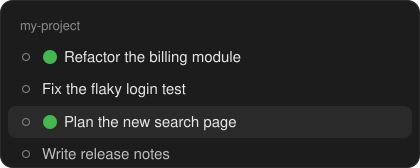
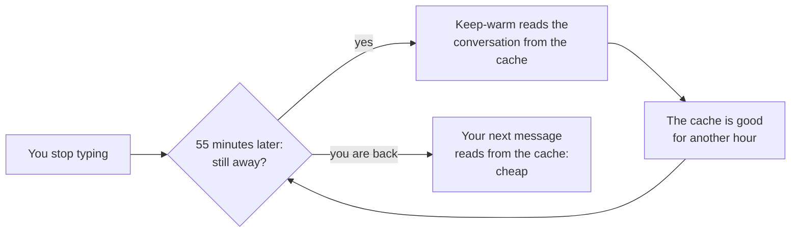

<div align="center">

# Cache Keep-Warm

**Stop paying to re-cache your whole Claude Code conversation after a break.**

A small mod for [Claude Code](https://code.claude.com) that shows how long your session's prompt cache stays warm, and keeps it warm while you are away.

[](LICENSE)
[](https://code.claude.com)


<br>


</div>

<br>

## Why you would want it

Claude Code keeps your conversation in a **prompt cache**, so every message only pays full price for what is new. But the cache expires when you stop typing for a while: **after one hour** on a Claude subscription, **after five minutes** on an API key.

Come back after that, and your next message has to write the **whole conversation** into the cache again. For a long session that is the most expensive message of the day.

Cache Keep-Warm fixes that:

- ⏱️ **See it.** A line above the prompt counts down until the cache expires.
- ♨️ **Keep it.** One click, and the cache stays warm while you are away: a tiny background read just before it would expire.
- 🟢 **Know where.** In the desktop app, every session being kept warm gets a green dot in the session list.

<div align="center">

</div>

### What it saves

Example: a long conversation of **500k tokens** on Claude Opus 5.5, at current API list prices.

| | Cost |
| --- | ---: |
| Your next message after the cache expired (re-writes everything) | **≈ $4.00** |
| One keep-warm ping (reads it from the cache) | ≈ $0.10 |
| Keeping it warm through an 8-hour night (8 pings) | ≈ $0.80 |

On a subscription you do not pay per token, but the same proportions apply to your usage limits.

<br>

## Install

### The easy way: let Claude do it

Copy this into any Claude Code session:

```text
Install the Cache Keep-Warm mod from https://github.com/andreichiritescu/claude-code-cache-keep-warm for me:
1. Run: claude plugin marketplace add https://github.com/andreichiritescu/claude-code-cache-keep-warm.git
2. Run: claude plugin install cache-keep-warm@cache-keep-warm
3. If a step fails because my Claude Code is too old, tell me to update it (the mod needs Claude Code 2.1.287 or newer, or the desktop app with 2.1.286 or newer) and stop.
4. When it is installed, tell me to run /reload-plugins so this session loads it, and that I can turn keep-warm on with the Keep warm button on the new line above the prompt, or with /keepwarm on.
```

### Or with one command in a session

Type this at the Claude Code prompt (Claude Code 2.1.275 or newer):

```text
/plugin install cache-keep-warm --marketplace https://github.com/andreichiritescu/claude-code-cache-keep-warm.git
```

### Or in your terminal

```bash
claude plugin marketplace add https://github.com/andreichiritescu/claude-code-cache-keep-warm.git
claude plugin install cache-keep-warm@cache-keep-warm
```

Then start a new session, or run `/reload-plugins` in an open one. The line appears above the prompt, and the countdown starts with your first message. If Claude Code says an option is not set yet, that is the **Mark the session title** setting: it is on by default.

> **Needs** Claude Code 2.1.287 or newer in a terminal, or the Claude desktop app with Claude Code 2.1.286 or newer. Type `/status` to check your version.

<br>

## Use it

Click **Keep warm** on the line, or type a command:

| Command | What it does |
| --- | --- |
| `/keepwarm on` | Keep this session warm |
| `/keepwarm 3h` | Keep it warm for 3 hours |
| `/keepwarm until 18:00` | Keep it warm until 18:00 |
| `/keepwarm off` | Stop (or click **Stop**) |
| `/keepwarm` | Show the state and the last pings |

Keep-warm is **off by default** and you switch it **per session**: only the sessions you want are kept warm. It stops by itself after about 18 hours (20 pings in a row) unless you gave it a time, because past that point one re-write is cheaper than more pings.

### Reading the line

| You see | It means |
| --- | --- |
| **◕** and **▰▰▰▰▰▰▰▱▱▱** | How much of the cache's life is left. **Green** while keep-warm is on, grey when it is off, and **○** once the cache has expired. |
| **40 min left (14:12)** | Time left, and the clock time the cache expires if nothing happens. |
| **next ping 14:07** | When keep-warm will read the cache next. |
| **3 pings ✓** | Pings so far, and whether the last one found the cache warm (✓) or cold (✗). |
| **773k cached** | The size of your conversation, which is what your next message would re-write if the cache went cold. |

<br>

## How it works



- **It never wakes a cold cache.** The ping goes out 5 minutes before the cache would expire. If the cache has already expired, keep-warm waits for your next message instead of paying to rebuild it.
- **Nothing is added to your conversation.** The ping sends your conversation once more, outside the chat, with a one-line question, and throws the answer away.
- **It works while Claude is waiting for you**, for example on a question it asked you or a permission prompt.
- **It is light.** The line itself never calls the model: one quick local check every 15 seconds, redrawn at most once a minute. The only thing that uses your plan or credits is the ping, about once every 55 minutes, in sessions where keep-warm is on.

<details>
<summary><b>How it knows how long your cache lasts</b></summary>

<br>

1. **Your settings**, if you set one: `promptCacheTtl`, `CLAUDE_CODE_PROMPT_CACHE_TTL`, `FORCE_PROMPT_CACHING_5M` or `ENABLE_PROMPT_CACHING_1H`.
2. **Otherwise your plan.** A Claude subscription within its usage limits gets one hour. Once you are over the limit (paying with usage credits), or on an API key or a cloud provider, it is five minutes.
3. **Then it checks what really happens.** Every request shows whether it read the conversation from the cache or had to re-write it. If the cache went cold sooner than expected, keep-warm pauses and tells you, and resumes once the cache is seen lasting again. So if Claude Code ever changes how long the cache lasts, the mod follows.

Keep-warm only pings a cache that lasts **30 minutes or more**: on the five-minute cache, pinging every few minutes would cost more than it saves.

</details>

<details>
<summary><b>Settings</b></summary>

<br>

| Setting | Default | What it does |
| --- | --- | --- |
| Mark the session title | On | While keep-warm is on, put 🟢 in front of the session's title in the desktop app's session list |

Change it in `/config`, or with `/plugin configure cache-keep-warm@cache-keep-warm`.

In the desktop app, renaming a title **you typed yourself** asks for your approval each time; titles the app generated change without asking.

</details>

<details>
<summary><b>Questions</b></summary>

<br>

**I use an API key. Does keep-warm work for me?**
Your cache lasts five minutes by default, so keep-warm does not ping. If you take longer breaks, set `promptCacheTtl` to `"1h"` in your Claude Code settings: the cache then lasts an hour and keep-warm works. One-hour cache writes cost more than five-minute ones, so this pays off only if you do take breaks.

**Will it ping forever if I forget it?**
No. It stops by itself after 20 pings in a row (about 18 hours), or at the time you gave it with `/keepwarm 3h` or `/keepwarm until 18:00`.

**Does it work in VS Code?**
The keep-warm pings work there, but the line is only drawn in the terminal and in the desktop app's Code tab.

**Where does the line not appear?**
In VS Code's chat panel, in `claude -p` runs and in cloud sessions.

**How do I remove it?**
`claude plugin uninstall cache-keep-warm@cache-keep-warm`

</details>

<br>

## What it runs, reads and sends

A mod runs inside Claude Code with your permissions, so here is everything this one does. It has no server, makes no network calls of its own, and runs no shell commands. This section is also its privacy policy: the mod collects nothing about you, and nothing reaches its author.

### What leaves your computer

Only the **keep-warm ping**, and only while keep-warm is on: about 5 minutes before the cache would expire, so about once every 55 minutes.

The mod asks Claude Code to send this session's last request again, with one line added: `Keep-warm ping. Reply with just "ok".` (the `$.model.fork` call in [`hooks/register.tsx`](hooks/register.tsx)). It goes **to Anthropic, through Claude Code's own connection, on your own account**, like any message you send. That request reads your conversation from the cache, which is what keeps it warm. The answer is thrown away, and nothing is added to your conversation.

The mod itself never reads what your conversation says: from each request it only takes the usage figures (how many tokens were read from the cache or written to it).

### The tools it calls itself

Only on the current session. Both are the Claude desktop app's own session tools, and nothing they do leaves your computer:

| Tool | What it does | When |
| --- | --- | --- |
| `mcp__ccd_session_mgmt__get_session` | Reads the session's title | When the session starts, when you switch keep-warm on or off, and every 5 minutes |
| `mcp__ccd_session_mgmt__set_session_title` | Puts 🟢 in front of the title, or takes it off | Only when the mark has to change |

With the setting **Mark the session title** off, the mod never adds the mark; it still reads the title at those moments, to take off a mark left from before. In a terminal these tools do not exist: the call fails quietly and nothing changes.

### What it reads

- **Your Claude Code settings**, for `promptCacheTtl` only, and three environment variables: `FORCE_PROMPT_CACHING_5M`, `CLAUDE_CODE_PROMPT_CACHE_TTL` and `ENABLE_PROMPT_CACHING_1H`, to know how long your cache lasts. Claude Code hands a mod the settings as one object: this mod looks at `promptCacheTtl` and nothing else, and keeps or sends no other setting, credential or API key.
- **This session's figures** from Claude Code: the conversation's size, the cache tokens of each request, and whether your plan's usage limits are reported (which tells a subscription from an API key).
- **The clock.**

It checks these every 15 seconds, on your computer, and sends none of them anywhere. It does not read your files.

### What it keeps

Per session, in Claude Code's plugin storage on your computer: the time of the last request, whether keep-warm is on, and the stop time you gave it. A session untouched for a week is forgotten.

### The events it hooks

| Event | What the mod does with it |
| --- | --- |
| Session start | Adds the `/keepwarm` command and starts its 15-second local check |
| Each request of the main conversation | Notes the time and how much was read from the cache. Changes nothing. Subagents' requests are ignored. |
| A turn ends | Notes that an answer arrived (which helps tell a subscription from an API key) |
| Claude's `AskUserQuestion` tool | Shows "waiting for your answer" while the question is open. Never changes the question or your answer. |
| The `/keepwarm` command | Answers its own command, and no other |
| The line above the prompt | Draws the countdown line |

To check all of this before you install it, clone the repository and run:

```bash
claude plugin validate ./claude-code-cache-keep-warm/.claude-plugin/plugin.json
```

The `hooks:`, `calls:` and `env reads:` lines list every event the mod handles, everything it asks Claude Code to do, and every environment variable it reads.

<br>

---

<div align="center">

[MIT License](LICENSE) · A community mod, not made by Anthropic · Issues and ideas welcome

</div>
